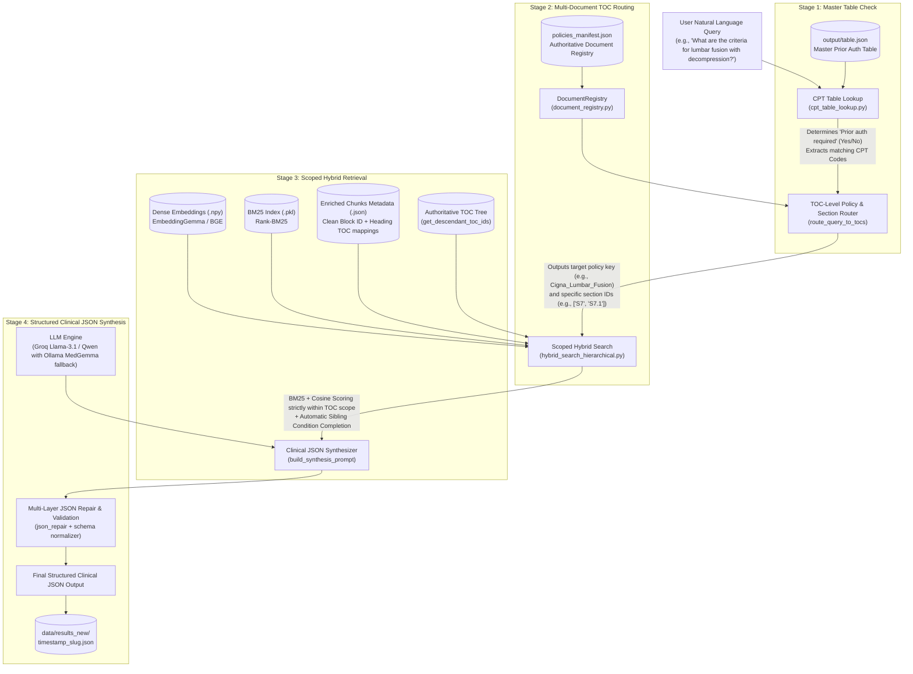

# System Architecture — Hierarchical Multi-Document Clinical Policy RAG

## 1. Executive Summary

This project implements an end-to-end, multi-document, Table of Contents (TOC)-guided, section-aware Retrieval-Augmented Generation (RAG) system designed for clinical coverage policy analysis and prior authorization verification.

The pipeline accepts natural language clinical queries, cross-references master CPT procedure tables, dynamically routes queries to the relevant medical coverage policy document (e.g., Cigna ACDF, Cigna Lumbar Fusion, and arbitrary future policies), retrieves exact policy criteria using scoped hybrid search (BM25 + Dense Embeddings with Sibling Condition Completion), and synthesizes a high-precision, validated JSON clinical determination.

---

## 2. End-to-End Pipeline Workflow



---

## 3. Four-Stage Pipeline Architecture

### Stage 1: Master Table Prior Authorization Check
- **File**: `hierarchical-processing/cpt_table_lookup.py`
- **Data Source**: `output/table.json`
- **Mechanism**:
  1. Filters conversational tokens (`prior`, `auth`, `required`, `please`, `give`, `documents`).
  2. Expands medical abbreviations and surgical concepts (`acdf` $\rightarrow$ `22551`, `adjacent segment` $\rightarrow$ `22551, 22612`, `lumbar fusion` $\rightarrow$ `22612`, etc.).
  3. Scans master table for matching CPT codes and procedure descriptions.
  4. Returns:
     - `"prior_auth_required"`: `"Yes"`, `"No"`, `"Add On"`, or `"Not Found"`
     - `"is_add_on"`: Boolean flag (`True` for surgical add-on procedures like `22552`)
     - `"matched_cpts"`: List of associated CPT codes
     - `"primary_description"`: Matched procedure category
  5. **Deterministic Bypass**: If the procedure is explicitly confirmed as not requiring prior auth (`"No"` or `"Not Found"` for routine outpatient screening tests like CBC, CMP, Lipid panel), the pipeline deterministically short-circuits Stage 2 and returns clean determination immediately with zero hallucinations.

### Stage 2: Dynamic Constrained Candidate-Index Routing
- **Files**:
  - `retrieval-hierarchical.py` (`get_ranked_candidate_sections`, `route_query_to_toc`)
  - `hierarchical-processing/document_registry.py`
  - `hierarchical-processing/policies_manifest.json`
- **Robustness Architectural Principles**:
  1. **Constrained Candidate-Index Selection**: Instead of asking an LLM to generate free-form TOC strings (which suffered from subword tokenizer transposition errors like `S38.5` vs `S3.58`), the prompt dynamically ranks and presents the top 6 candidate policy sections as numbered options:
     ```
     [1] Policy: Cigna_Lab_Management | Section: [S3.58] Prolaris
     [2] Policy: Cigna_Lab_Management | Section: [S3.17] Decipher Prostate
     ...
     ```
     The LLM selects only an integer index (`"selected_candidate": 1`) or `null`. The code maps the index to a verified `toc_id`. LLMs are never permitted to manufacture or format TOC ID strings.
  2. **Multi-Signal Dynamic Candidate Pre-Ranking**:
     - **Exact CPT Code Hits (+25.0 boost)**: Scans chunk texts across all registered policies for direct query CPT matches.
     - **BM25 Semantic Text Relevance**: Pulls top chunk scores per section.
     - **Lexical Title Overlap (+3.0 to +8.0 boost)**: Matches procedure terminology against TOC section titles across all policies.
  3. **Canonical Ancestor Collapse (`canonical_parent`)**:
     - In documents where PDF chapter headings repeat across subsequent pages (e.g. Lumbar Fusion `S5.2` repeating `CMM-609.2: Osteotomy`), Docling creates duplicate child nodes with minimal or 0 content.
     - The pipeline automatically detects child nodes whose title duplicates an ancestor node and collapses them to the highest ancestor (`S5`), guaranteeing that scoped retrieval traverses the complete section hierarchy (`S5.1.1` PCO, `S5.1.2` Three-Column Osteotomy).
  4. **Deterministic TOC ID Validator**:
     - Confirms proposed `toc_id` exists in `flat_toc`.
     - Automatically snaps partial prefixes or child nodes to verified canonical sections.

### Stage 3: Scoped Hybrid Retrieval with Strict TOC Filtering & Self-Healing
- **Files**:
  - `hybrid_search_hierarchical.py` (`scoped_search`)
  - `retrieval-hierarchical.py` (`retrieve_scoped_chunks`)
- **Mechanism**:
  1. **Authoritative Descendant Resolution**: Uses `get_descendant_toc_ids()` over the policy's `toc_tree` structure. Routing to a parent node (e.g., `S5` or `S7`) automatically scopes retrieval to include all nested child conditions.
  2. **Canonical Ancestor Expansion**: If a candidate section was a child leaf sharing an ancestor title, both child and ancestor are queried to prevent stranding on placeholder headers.
  3. **Scoped Candidate Filtering**: BM25 and dense vector cosine similarity are calculated strictly within the scoped subset of chunks, eliminating false-positive matches from unrelated policy chapters.
  4. **Self-Healing Retry**: If Candidate #1 unexpectedly yields 0 chunks, Stage 3 automatically falls back to runner-up candidate sections before terminating.
  5. **Sibling Condition Completion**: Automatically incorporates sibling clinical sub-conditions to guarantee criteria completeness.

### Stage 4: Structured Clinical JSON Synthesis & Normalization
- **File**: `retrieval-hierarchical.py` (`normalize_clinical_json`, `build_synthesis_prompt`)
- **Mechanism**:
  1. **Resilient LLM Execution**:
     - Primary: Groq API (`groq/compound-mini`, `llama-3.1-8b-instant`, `openai/gpt-oss-120b`).
     - Includes exponential backoff (`time.sleep(1.5)`) on transient HTTP 429 rate limits.
     - Automatic fallback: Local Ollama endpoint (`medgemma-1.5-4b-it-GGUF:Q8_0`) with explicit negative reasoning constraints.
  2. **Investigational / Non-Covered Handling (Prompt Rule 8)**:
     - For experimental or unproven tests with zero covered indications (e.g., DermTech `0089U`), the prompt explicitly instructs the LLM to output `"Medical necessity indications": []` and thoroughly document all exclusions and clinical trial requirements under `"Non-Indications"`.
  3. **Multi-Layer JSON Repair & Schema Normalization**:
     - Strips reasoning/thinking tags (`<think>...</think>`).
     - Slices from the first opening brace `{`.
     - Cleans trailing commas and unclosed quotes using `json_repair`.
     - `normalize_clinical_json` provides case-insensitive key reconciliation (`non-indications`, `documentation required`, etc.) and guarantees all 8 required schema keys exist with default lists (`[]`).

---

## 4. Chunk-to-TOC Mapping Architecture

To ensure the pipeline works across any arbitrary Cigna document, chunk-to-TOC mapping (`chunk_toc_mapper.py`) uses a reliable multi-tier join:

```
Docling Document JSON
       │
       ├── block_id ───────► Block ID Exact Match (Primary Join)
       │                      └── High confidence, directly from Docling parsing
       │
       ├── heading_path ───► Heading Path Hierarchical Match
       │                      └── Aligns full breadcrumb trail to TOC node
       │
       ├── section_title ──► Normalized Title Match
       │                      └── Matches direct section heading to TOC node
       │
       └── (No Match) ─────► Clean Unmapped Fallback
                              └── Marked with toc_id: null (no arbitrary S1 fallback)
```

### Key Architectural Fixes:
1. **Removed Fragile Regex**: Eliminated `re.match(r"^\d+\.\s+", sec)`, which previously misclassified numbered instructions (e.g., `"1. The terms of..."`) as References (`S17`).
2. **Eliminated `preamble_fallback`**: Chunks without headings (e.g., cover images) are set to `toc_id: null` with `toc_match_method: "unmapped"` rather than arbitrarily polluting `S1`.
3. **Decoupled Reference Handling**: Reference pruning is handled centrally by TOC generation, avoiding dual-maintenance heuristics.

---

## 5. Repository & Directory Structure

```
project2/
├── architecture.md                        # Complete system architecture documentation (this file)
├── retrieval-hierarchical.py              # Main orchestrator for end-to-end multi-doc RAG pipeline
├── hybrid_search_hierarchical.py          # Scoped hybrid search engine (BM25 + Dense + Sibling completion)
├── evaluate_benchmark.py                  # 10-Question accuracy benchmark suite
├── requirements.txt                       # Python dependencies
├── .env                                   # Environment configuration (LLM keys, Ollama host, models)
├── .gitignore                             # Git ignore rules
│
├── hierarchical-processing/               # Policy processing, indexing & retrieval modules
│   ├── policies_manifest.json             # Authoritative registry of policy index files
│   ├── document_registry.py               # Dynamic document discovery & multi-TOC prompt builder
│   ├── cpt_table_lookup.py                # Prior Auth master table matcher with stop-word filter
│   ├── chunk_toc_mapper.py                # Clean block-ID and heading-path TOC mapper
│   ├── build_bm25.py                      # BM25 index builder
│   ├── embedding_with_section.py          # Dense vector embedding generator
│   ├── chunking_heirarchical.py           # Hierarchical chunker
│   ├── toc_v2.py                          # Hierarchical TOC tree extractor
│   ├── retrieve.py                        # Standalone scoped hybrid retrieval CLI
│   │
│   ├── ACDF_toc_output_new.json           # Canonical TOC JSON for Cigna ACDF (CMM-601)
│   ├── acdf_metadata.json                 # Enriched chunk metadata for ACDF
│   ├── acdf_embeddings.npy                # Dense vector embeddings matrix (177 x 768)
│   ├── acdf_bm25.pkl                      # Serialized BM25 index for ACDF
│   ├── toc_tree.txt                       # Readable TOC outline for ACDF
│   │
│   └── md/                                # Lumbar Fusion & future policy artifacts
│       ├── Lumbar_toc_output.json         # Canonical TOC JSON for Lumbar Fusion (CMM-609)
│       ├── toc_tree.txt                   # Readable TOC outline for Lumbar Fusion
│       ├── embeddings/
│       │   ├── lumbar_fusion_metadata.json# Enriched chunk metadata for Lumbar Fusion
│       │   └── lumbar_fusion_embeddings.npy# Dense vector embeddings (302 x 768)
│       └── bm25/
│           └── lumbar_fusion_bm25.pkl     # Serialized BM25 index for Lumbar Fusion
│
├── output/
│   └── table.json                         # Master Prior Authorization & CPT code lookup table
│
└── data/
    ├── benchmark_results.json             # Aggregate benchmark scorecard & test logs
    └── results_new/                       # Timestamped structured JSON outputs per query
```

---

## 6. Standard Output JSON Schema

Every pipeline execution produces a validated clinical determination report matching this schema:

```json
{
  "Prior auth required": "Yes",
  "Policy Name": "Cigna Lumbar Fusion (CMM-609: Lumbar Fusion with Decompression)",
  "Referred Sections": [
    "CMM-609.4: Lumbar Fusion (Arthrodesis) with Decompression",
    "Actual Instability",
    "Anticipated Iatrogenic Instability"
  ],
  "Medical necessity indications": [
    {
      "Guideline Category": "Actual Instability",
      "Required findings": [
        "Candidate for lumbar decompression or lumbar corpectomy per CMM-608.",
        "Imaging demonstrates degenerative spondylolisthesis with dynamic instability >3 mm or Grade II+ spondylolisthesis.",
        "Documented nicotine-free status (abstinent >= 6 weeks with normal cotinine test)."
      ],
      "Source": "CMM-609.4: Lumbar Fusion (Arthrodesis) with Decompression > Actual Instability"
    }
  ],
  "Non-Indications": [
    "Procedure performed for chronic non-specific back pain without objective instability",
    "Active tobacco/nicotine use without objective cotinine-verified cessation"
  ],
  "Important criteria & exceptions": [
    "If instability is identified intra-operatively, pre-operative imaging criteria are not required."
  ],
  "Documentation required": [
    "Flexion-extension lumbar radiographs showing dynamic translational difference > 3mm",
    "Pre-operative laboratory cotinine test results confirming nicotine-free status"
  ]
}
```

---

## 7. How to Add a New Cigna Policy Document

The pipeline is completely generic. To onboard any new Cigna coverage policy PDF:

1. **Parse with Docling**: Convert the PDF to hierarchical markdown and JSON format:
   ```bash
   python3 docling/docling_pdf.py --input extra_pdfs/New_Policy.pdf --output output/New_Policy_hierarchical.json
   ```
2. **Generate TOC Tree**:
   ```bash
   python3 hierarchical-processing/toc_v2.py output/New_Policy_hierarchical.json
   ```
3. **Chunk and Map TOC**:
   ```bash
   python3 hierarchical-processing/chunking_heirarchical.py
   python3 hierarchical-processing/chunk_toc_mapper.py
   ```
4. **Build Embeddings & BM25**:
   ```bash
   python3 hierarchical-processing/embedding_with_section.py
   python3 hierarchical-processing/build_bm25.py
   ```
5. **Register in Manifest**: Add an entry to [`hierarchical-processing/policies_manifest.json`](file:///home/vijaykumar/Desktop/project2/hierarchical-processing/policies_manifest.json):
   ```json
   {
     "doc_key": "Cigna_New_Policy",
     "display_name": "Cigna New Policy (CMM-XXX)",
     "toc_file": "new_policy_toc_output.json",
     "metadata_file": "new_policy_metadata.json",
     "embeddings_file": "new_policy_embeddings.npy",
     "bm25_file": "new_policy_bm25.pkl"
   }
   ```
   *The router will immediately begin routing relevant queries to the new policy without any code modifications.*

---

## 8. Execution Commands Quick Reference

```bash
# 1. Multi-Document End-to-End Pipeline (Automatic Routing)
./venv/bin/python retrieval-hierarchical.py "What are the clinical coverage criteria for Lumbar Fusion with Decompression?"

# 2. Scoped Retrieval CLI Targeting a Specific Policy
./venv/bin/python hierarchical-processing/retrieve.py --doc Cigna_Lumbar_Fusion "What are the indications for decompression?"

# 3. Accuracy Benchmark Evaluation Suite
./venv/bin/python evaluate_benchmark.py
```
